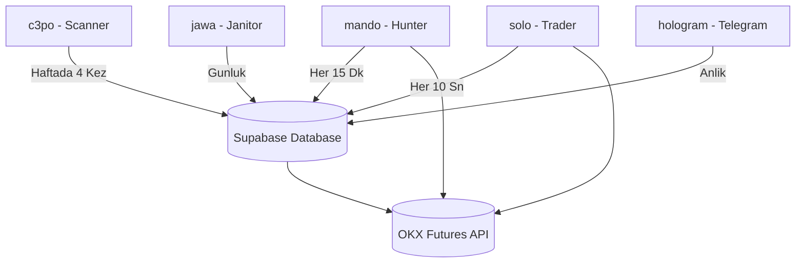

# OKX Ultra — Bot Mimarisi (Architecture)
**Son Guncelleme:** 7 Temmuz 2026  
**Durum:** V2 Canli Mimarisi

---

## 1. Genel Tasarim Modeli (Stateless Architecture)

OKX Ultra, moduller arasi doğrudan veri paylasimi yerine **veritabani (Supabase) tabanli durum takibi (Stateless)** modeli kullanir. Her modul bagimsiz bir surec olarak calisir ve mevcut durumu tamamen Supabase tablolarindan okur.

---

## 2. Moduller ve Gorevleri

### 1. [c3po.py](file:///D:/OKX%20Ultra/kodlar/c3po.py) — Scanner (Optimizasyon Motoru)
* **Gorevi:** Walk-Forward Optimization (WFO) yaparak her coin icin en karlı calisan parametreleri bulur.
* **Calisma Periyodu:** Haftada 4 kez (Pzt 03:00, Sal 21:00, Per 15:00, Cmt 09:00).
* **Akis:**
  1. OKX'ten son 750 bar (15M) veriyi ceker.
  2. 192 kombinasyonlu grid uzerinde en yuksek PnL veren `most_period`, `most_pct`, `stoch_len` ve `wma_len` degerlerini bulur.
  3. Sonuclari Supabase [guide_table] tablosuna yazar ve Telegram'a raporlar.

### 2. [mando.py](file:///D:/OKX%20Ultra/kodlar/mando.py) — Hunter (Sinyal Avcisi)
* **Gorevi:** 15 dakikalik mum kapanislarinda yeni giris sinyali arar.
* **Calisma Periyodu:** Her 15 dakikada bir (15M bar kapanislariyla senkronize).
* **Akis:**
  1. Supabase [guide_table] tablosundan her coin icin güncel optimize parametreleri okur.
  2. 15M mum kapanis verilerine göre MOST ve IFTStoch sinyallerini hesaplar.
  3. V1 esnek giris mantigina gore (20 bar siniri, crossover'siz, ±0.5 esigi) sinyal olusursa Supabase [active_positions] tablosuna `PENDING` durumunda yeni bir pozisyon kaydi ekler.

### 3. [solo.py](file:///D:/OKX%20Ultra/kodlar/solo.py) — Trader (Islem Yoneticisi)
* **Gorevi:** Emrin borsaya iletilmesini, gerceklesmesini ve aktif trailing stop-loss (iz suren stop) takibini yapar.
* **Calisma Periyodu:** Her 10 saniyede bir kesintisiz calisan daemon.
* **Akis:**
  * **Pending Emir Yonetimi:** `PENDING` olan islemleri OKX'e **Post-Only Limit Emir** olarak gonderir. Dolunca veritabanini `FILLED` yapar. Limit emir dolmaz ve fiyat %0.15 uzaklasirsa emri iptal eder.
  * **Aktif Pozisyon Yonetimi:** `FILLED` olan pozisyonlar icin OKX'ten anlik acik kontrat adedini (`pos_amount`) okur ve MOST cizgisine **Stop-Limit (Algo Order)** yerlestirir.
  * **Trailing Stop Guncelleme:** Her 15 dakikada bir yeni MOST seviyesini hesaplar. Eski algo emrini borsa uzerinden `privatePostTradeCancelAlgos` ile **iptal eder** ve yeni MOST seviyesine yeni stop-limit koyar.
  * **Harici Kapatma Kontrolu:** Pozisyon OKX uygulamasindan manuel kapatildiysa bunu tespit eder, veritabanini esitler ve stop limit emrini temizler (`EXTERNAL_CLOSE`).

### 4. [jawa.py](file:///D:/OKX%20Ultra/kodlar/jawa.py) — Janitor (Temizlik ve Kontrol)
* **Gorevi:** Hesap bakiyesi ve borsa minimum limitlerini kontrol eder.
* **Calisma Periyodu:** Gunluk 1 kez.
* **Akis:** Mevcut bakiyeyle OKX'te minimum 1 kontrat dahi acilamayacak kadar pahali olan coinleri kara listeye alır ([blacklist] tablosuna yazar) boylece Hunter'in gereksiz emir vermesini onler.

### 5. [hologram.py](file:///D:/OKX%20Ultra/kodlar/hologram.py) — Telegram Yoneticisi
* **Gorevi:** Kullanicidan gelen Telegram komutlarini dinler ve bot durumunu raporlar.
* **Calisma Periyodu:** Anlik (Polling).
* **Desteklenen Komutlar:** `/durum`, `/tekislem`, `/tara`, `/kapat`, `/yardim`.

---

## 3. Supabase Veritabani Schema Yapisi

### `active_positions` (Aktif Pozisyonlar)
* `coin` (text, Primary Key)
* `side` (text - BUY/SELL)
* `entry_price` (numeric)
* `position_size` (numeric)
* `leverage` (int)
* `sl_price` (numeric)
* `status` (text - PENDING/FILLED)
* `order_id` (text)
* `entry_time` (timestamp)

### `guide_table` (Optimizasyon Rehber Tablosu)
* `coin` (text, Primary Key)
* `most_period` (int)
* `most_pct` (numeric)
* `stoch_len` (int)
* `wma_len` (int)
* `opt_pnl` (numeric)
* `updated_at` (timestamp)

### `trade_history` (Gecmis Islemler)
* `id` (int, Auto Increment)
* `coin` (text)
* `side` (text)
* `entry_price` (numeric)
* `exit_price` (numeric)
* `pnl_usd` (numeric)
* `pnl_pct` (numeric)
* `fees` (numeric)
* `entry_time` (timestamp)
* `exit_reason` (text - TRAILING_SL_HIT, TREND_EXIT, EXTERNAL_CLOSE)
* `exit_time` (timestamp)
